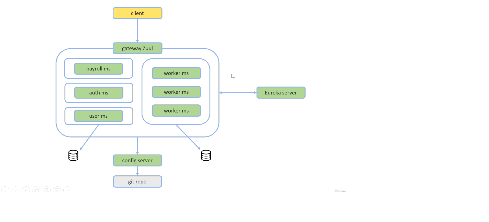

# Microsserviços Java com Spring Boot e Spring Cloud

Esse projeto é um sistema composto por vários microsserviços que comunicam entre si de forma **transparente**, **escalável** e com **balanceamento de carga**.

Para isso foi utilizado ferramentas do **Spring Cloud** como:

### Eureka
O Eureka é um serviço REST que é usado para localizar serviços com o objetivo de balanceamento de carga. Ele permite que serviços sejam registrados através do Eureka Server e descobertos através do Eureka Client,

Os microsserviços são registrados em um "Discovery Server" (Eureka), de modo que a comunicação entre eles é feita pelo nome do microsserviço.

Para se aprofundar melhor sobre esse assunto: [Artigo Eureka](https://medium.com/@michellibrito/netflix-eureka-comunica%C3%A7%C3%A3o-entre-microservices-383d32d39506) artigo bem interessante.

### Ribbon
É responsável por realizar a comunicação entre os diversos microservices e fazer o balanceamento de carga. O Ribbon também faz o tratamento de uma eventual falha em uma chamada de um microservice.

Referência: [sobre ribbon](https://blog.andrefaria.com/monolitico-aos-microservices-com-netflix-oss)

### Hystrix
O hystrix é uma ferramenta que ajuda na falha de disponibilidade no projeto. Quando um determinado microservice falhar, ele “abrirá o circuito” e direcionará as chamadas para um outro microservice que atuará como um fallback.

Referência: [sobre hystrix](https://blog.andrefaria.com/monolitico-aos-microservices-com-netflix-oss)
### Zuul
Zuul Server é um aplicativo API Gateway. Ele lida com todas as solicitações e executa o roteamento dinâmico de aplicativos de microsserviço.

Foi utilizado para fazer requisições, ou seja, ele é responsável por rotear e autorizar as requisições nesse projeto.

### Servidor de autorização (Oauth2)

### Servidor de configuração
Tem o objetivo de centralizar toda a configuração da nossa rede de Microservices em um só lugar. 

Todos os arquivos de configuração do nosso sistema estarão em um repositório git e o Servidor de Configuração será o responsável por ler as informações no repositório e fornece-las às aplicações através de requests HTTP.

  
  

  📩 dev_gabrielsouza@hotmail.com
  

---

Desenvolvid por Gabriel Souza.

